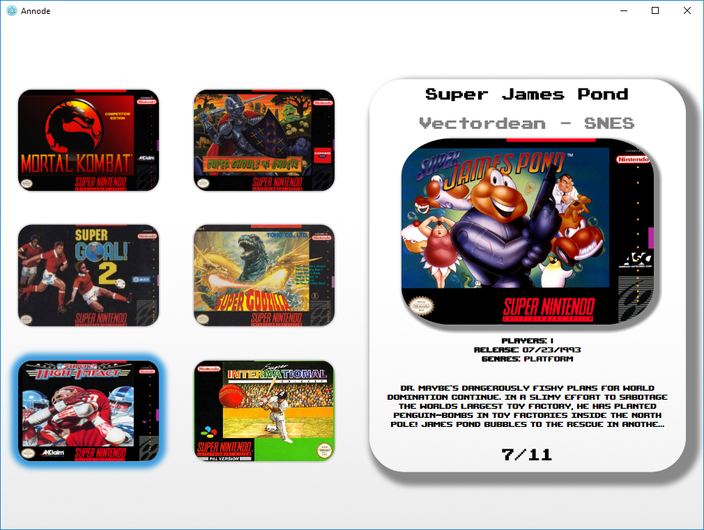
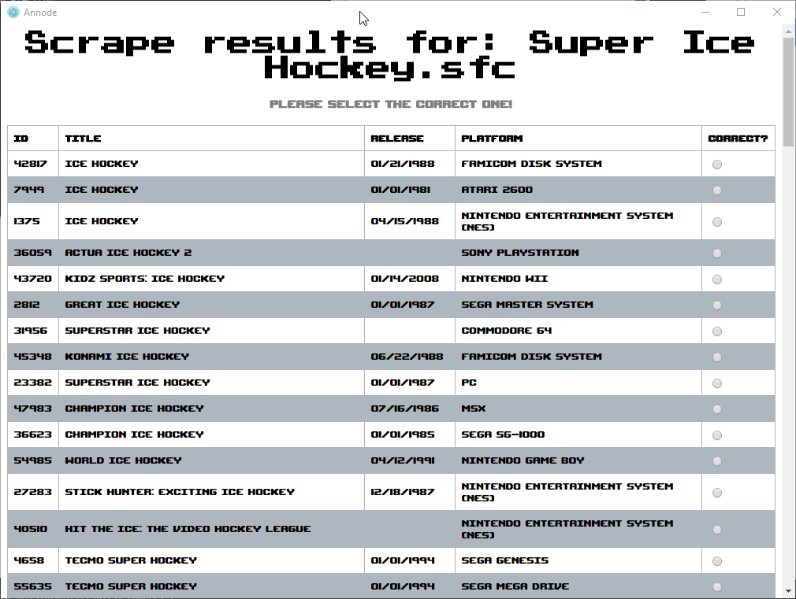
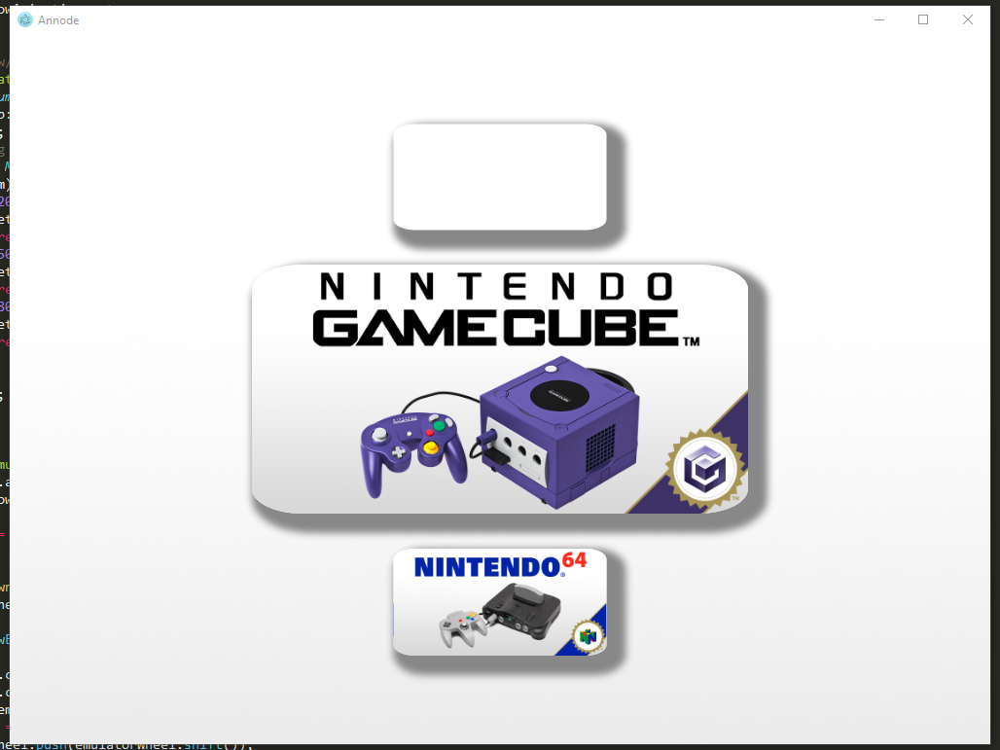

# Anode Arcade Front-loader
## What is Anode?
Anode is a JS-based open source arcade frontloader* originally that started as an idea but quickly became a core part of my EP for 6th form. The goal was to build an entire arcade machine from scratch including the software (aside from emulators and ROMs). Anode was created with the goal of being incredibly user-friendly and providing a simple, polished arcade experience.

_*an arcade frontloader is a piece of software designed for arcade machines that hide the OS they run on_

## Screenshots
_LAST UPDATED 03/06/18 - UI Looks of Anode are subject to change_

## How does Anode function?
Anode utilises  Electron which utilises the power of Chromium to run javascript-based applications on the desktop. It can also use other frameworks and libraries. For example, Anode uses jQuery and nothing else (as I wanted to keep it minimal) but in theory I could use React, Angular etc. if I needed to.
## Current Features/Goals
_This list is incomplete and will be built on as suggestions/ideas surface_
- [x] Front-end GUI for accessing the different emulators & roms
- [x] Emulator configuration
- [x] Simple rom importing
- [x] Gamepad support
- [x] Metadata & image scraping
- [ ] Visual candy in menu
- [ ] Customisability (custom backgrounds, videos, screenshots etc.)
- [ ] Optimisation
- [x] Config file to specify custom paths & options etc.
## Documentation
The documentation of the project can be seen in the wiki on this repository. On each page there is a simple sumamry of each 'module' of the frontloader and an in-depth one too.  
## Project progression
For a look at proper timetabling, research etc. it's best to see my EP folder as I have included everything external to Anode (the UI programming portion of my EP (this repository)) in there. However, as this was a large part of my EP all of the documentation for Anode can be seen in the wiki.
